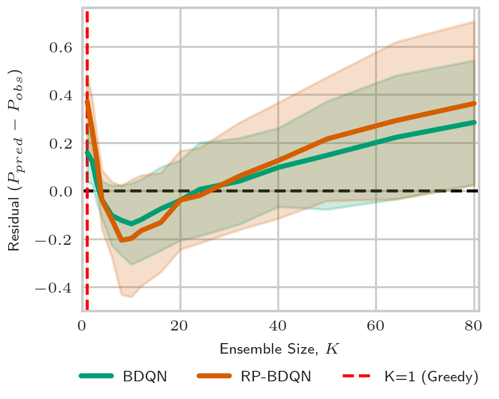
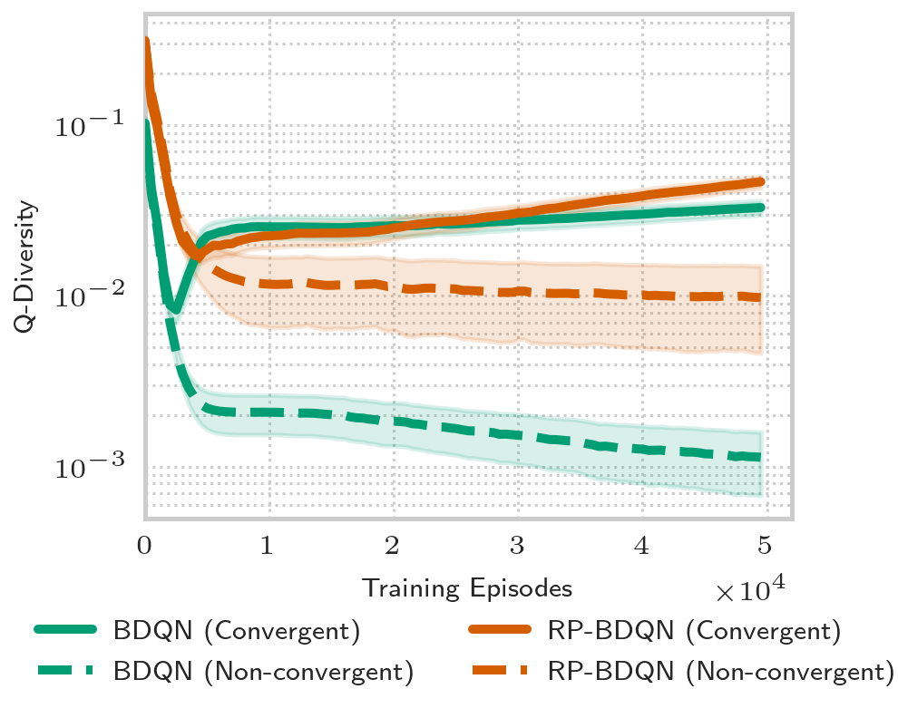
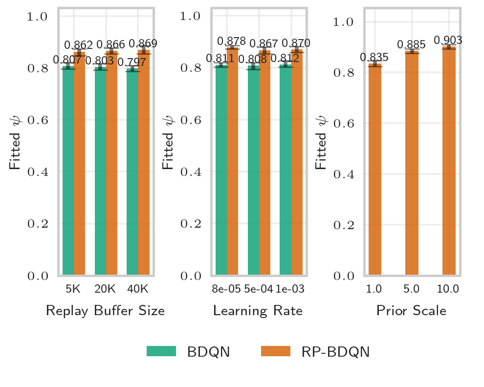

# A Unified Scaling Law of Bootstrapped DQNs


This repository implements **Bootstrapped DQN (BDQN)** and **Randomized-Prior BDQN (RP-BDQN)** in JAX, supporting the research findings presented in our paper *"A Unified Scaling Law for Bootstrapped DQNs"*. The implementation is designed for large-scale empirical studies of ensemble-based exploration methods in deep reinforcement learning.

## 🔬 Research Overview

Our work presents the first comprehensive empirical study (>40,000 configurations) of bootstrapped DQN methods, revealing a unified scaling law that governs their convergence behavior:

```
P(convergence) ≈ 1 - (1 - ψⁿ)ᴷ
```

Where:
- **ψ** is the method-specific effectiveness parameter
- **n** is the task hardness (DeepSea grid size)
- **K** is the ensemble size

### Key Findings

- **RP-BDQN significantly outperforms BDQN**: ψ ≈ 0.87 vs ψ ≈ 0.80
- **RP-BDQN solves ~1.5× harder tasks** than BDQN with equivalent ensemble sizes
- **Diminishing returns** for ensemble sizes K > 10
- **Posterior collapse** is the primary failure mode in BDQN, mitigated by randomized priors


## 🏗️ Architecture

### Core Components

- **`main.py`** - Main training orchestrator with parallel execution support
- **`models.py`** - Neural network architectures (Model, ModelWithPrior, Bootstrapped ensembles)
- **`replay_buffer.py`** - JAX-optimized replay buffer with compression support
- **`evaluate.py`** - Analysis pipeline for generating scaling law plots and statistics
- **`helpers.py`** - Utilities for data serialization and experiment management

### Agent Types

1. **`boot`** - Bootstrapped DQN with K ensemble members
2. **`bootrp`** - Bootstrapped DQN with Randomized Priors
3. **`eps`** - Epsilon-greedy baseline (single network)

## ⚡ Quick Start

### Installation

```bash
# Clone the repository
git clone https://github.com/yourusername/nanodqn.git
cd nanodqn

# Install with uv (recommended)
uv sync

# Or with pip
pip install -e .
```

### Basic Usage

```python
from main import main, Config
from jax import random as jr

# Single training run
key = jr.key(42)
cfg = Config(
    kind="bootrp",           # Use RP-BDQN
    ensemble_size=10,        # 10 ensemble members
    hardness=16,             # DeepSea(16) environment
    num_episodes=50_000,     # Training budget
    prior_scale=3.0          # Prior network scaling
)

model, logs = main(key=key, cfg=cfg)
```

### Large-Scale Experiments

```python
from main import schedule_runs, Config

# Run scaling study
results = schedule_runs(
    N=32,                    # 32 random seeds
    cfg=Config(
        kind="bootrp",
        ensemble_size=10,
        hardness=20
    ),
    output_root="results/"
)

print(f"Success rate: {results['weak_convergence'].mean():.2f}")
```

## 📊 DeepSea Environment

We use the **DeepSea(n)** environment as our testbed:

- **Grid size**: n × n (hardness parameter)
- **Objective**: Navigate from (1,1) to (n-1,n-1)
- **Reward structure**: +1 at goal, -0.01/n for right moves, 0 for left moves
- **Exploration challenge**: Exponentially harder with increasing n

The environment parameterizes exploration difficulty through a single interpretable parameter, making it ideal for systematic scaling studies.

## 🔬 Experimental Pipeline

### Configuration

```python
Config(
    # Core parameters
    ensemble_size=10,          # Number of ensemble members (K)
    hardness=16,               # DeepSea grid size (n)
    kind="bootrp",             # Algorithm: boot, bootrp, eps

    # Training setup
    num_episodes=50_000,       # Episode budget
    batch_size=64,             # Training batch size
    lr=2e-4,                   # Learning rate (auto-scaled by K)

    # Environment
    env_name="DeepSea-bsuite",
    randomize_actions=True,    # Prevents spatial bias

    # RP-BDQN specific
    prior_scale=3.0,           # Prior network scaling factor

    # Infrastructure
    num_envs=24,               # Parallel environments
    rb_size=10_000            # Replay buffer size
)
```

### Running Experiments

```python
# Reproduce main scaling study
from main import exp_heatmap
exp_heatmap()

# Hyperparameter sensitivity analysis
from main import exp_sweep
exp_sweep()
```

### Analysis and Visualization

```python
from evaluate import plot_frontier_and_heatmaps, plot_residuals, plot_diversity_collapse

# Generate main results figures
plot_frontier_and_heatmaps()
plot_residuals()
plot_diversity_collapse()
```

### Model Performance Analysis

The scaling law shows systematic deviations at extreme ensemble sizes:



This U-shaped residual pattern reveals the model's limitations: it overestimates performance for both very small (K=1) and very large ensembles, working best in the middle range.

## 📈 Key Results

### Scaling Law Parameters

| Algorithm | ψ (Effectiveness) | R² | Dispersion |
|-----------|-------------------|--------|------------|
| BDQN      | 0.80 ± 0.01      | 0.84   | 4.1        |
| RP-BDQN   | 0.87 ± 0.02      | 0.69   | 8.1        |

### Performance Boundaries

- **BDQN**: Reliable up to DeepSea(~20) with moderate ensembles
- **RP-BDQN**: Extends boundary to DeepSea(~30), ~1.5× improvement
- **Ensemble scaling**: Diminishing returns beyond K=10 for both methods

### Mechanistic Understanding

Our analysis reveals that **ensemble diversity** is the key differentiator:

1. **BDQN suffers from "posterior collapse"** - all ensemble members converge to identical policies
2. **RP-BDQN maintains diversity** via randomized priors that anchor members in different parameter regions
3. **Q-Diversity metric** quantifies this phenomenon across training



The plot above shows how Q-diversity (ensemble disagreement) evolves during training. RP-BDQN maintains higher diversity throughout training, while BDQN shows premature collapse in failed runs.

## 🛠️ Advanced Usage

### Custom Environments

```python
# Extend to new environments (must be discrete, episodic)
cfg = Config(
    env_name="YourEnvironment-v0",
    hardness=custom_difficulty_param,
    # ... other parameters
)
```

### Model Architecture

```python
# Customize network architecture
from models import Model

model = Model(
    observation_size=obs_dim,
    action_size=act_dim,
    layer_sizes=[64, 64],    # Hidden layer sizes
    key=jr.key(0)
)
```

### Hyperparameter Studies

```python
# Systematic hyperparameter exploration
for prior_scale in [1.0, 3.0, 5.0, 10.0]:
    for ensemble_size in [1, 4, 8, 16]:
        cfg = Config(
            kind="bootrp",
            prior_scale=prior_scale,
            ensemble_size=ensemble_size,
            # ... other params
        )
        results = schedule_runs(32, cfg, "results/sweep/")
```

### Hyperparameter Sensitivity

Our robustness analysis across different hyperparameter settings shows that the ψ parameter is remarkably stable:



The effectiveness parameter ψ remains consistently higher for RP-BDQN across learning rates, replay buffer sizes, and prior scales, confirming the robustness of our findings.

## 🔧 Performance Optimization

### JAX Configuration

The implementation includes several JAX optimizations:

```python
# Memory optimization
os.environ["XLA_PYTHON_CLIENT_MEM_FRACTION"] = "0.95"

# Compilation parallelism
os.environ["XLA_FLAGS"] = "--xla_gpu_force_compilation_parallelism=8"

# Persistent compilation cache
jax.config.update("jax_compilation_cache_dir", ".jax_cache")
```

### Multi-GPU Scaling

The implementation uses DDP via jax sharding by default!

```python
# Automatic device utilization
max_trainings_in_parallel = 32 * jax.device_count()

# Sharded parallel execution
if jax.device_count() > 1:
    mesh = jax.make_mesh((jax.device_count(),), ("x",))
    sharding = jax.sharding.NamedSharding(mesh, P("x"))
```

## 📚 Citation

If you use this code in your research, please cite our paper:

```bibtex
@article{knyazhitskiy2025unified,
  title={A Unified Scaling Law for Bootstrapped DQNs},
  author={Knyazhitskiy, Roman},
  journal={arXiv preprint},
  year={2025}
}
```

## 🤝 Contributing

We welcome contributions! Areas of particular interest:

- Extension to continuous control environments
- Alternative ensemble diversity mechanisms
- Theoretical analysis of the ψ parameter
- Computational optimizations

## 📋 Requirements

- Python ≥ 3.10
- JAX with CUDA support (for GPU acceleration)
- See `pyproject.toml` for complete dependencies

## 🏃‍♂️ Reproducibility

All experiments are designed for complete reproducibility:

- **Deterministic seeding** based on configuration hashing
- **Environment state serialization** for exact replay
- **Comprehensive logging** of all hyperparameters and metrics
- **Version-controlled results** with automatic experiment tracking

## 📝 License

MIT License - see LICENSE file for details.

## 🙋‍♂️ Support

For questions about the implementation or research:

- Open an issue on GitHub
- Email: dqn.scaling.laws@knyaz.tech

---

*This implementation supports the empirical findings in "A Unified Scaling Law for Bootstrapped DQNs" and provides a foundation for future research in ensemble-based exploration methods.*
